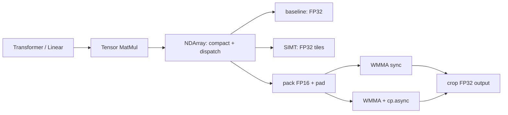

# 实现与边界

## 从模型到 CUDA

`needle.gemm_mode` 使用 `ContextVar`，允许嵌套并在异常时恢复。默认 `baseline` 保持原始 FP32 路径；CPU 后端保持 FP32。Tensor Core 必须显式选择，在 CUDA 上要求 SM80+。

## 三种优化实现

| 路径 | 核心设计 | 边缘尺寸 |
|---|---|---|
| SIMT | 128×128×8 block tile、每线程 8×8 输出、float4 搬运、寄存器与共享内存双缓冲 | M/N 非 128 倍数或 K 非 8 倍数，回退原始 FP32 |
| WMMA | 64×64×32 block tile、2×2 warp、每 warp 32×32 输出、m16n16k16 fragment | M/N 补齐到 64，K 补齐到 32 |
| TC pipeline | 相同 WMMA 分块，cp.async 预取到另一共享内存 stage，与当前计算重叠 | 同 WMMA；最后裁剪回原始形状 |

TC 输入由 GPU 从 FP32 转为 FP16；乘加累积与输出为 FP32。共享内存显式对齐到 32 bytes，block barrier 保证 stage 复用之前所有 warp 已完成读取。

`PreparedGemm` 用于把转换与分配移出内核计时，同时提供同样 padded FP16 输入、FP32 计算/输出的 `cublasGemmEx` 对照。cuBLAS 只是 benchmark 参考，不替代自写内核。

## 测量口径

- **framework**：同步 wall time，包含 Python dispatch、分配、输入转换、补零、内核、输出裁剪和临时资源释放，报告 median、P90 和每次样本。
- **prepared kernel**：预分配和预打包后使用 CUDA events 的批次平均时间；不含输入预处理、裁剪和 Python 调用。小矩阵仍可能受到 launch 间隙影响。
- **cuBLAS**：相同精度、相同补齐后的形状；handle 创建在计时外。它不是原始非补齐形状下的 cuBLAS 最佳性能上界。
- **TransformerLayer**：同一模型、参数、输入，eval / dropout=0，只改变实现开关；包含框架计算图构造开销。

精度检查分别使用原 FP32 输入和舍入为 FP16 后输入的 FP64 参考。TFLOPS 同时区分有效 FLOPs 与补齐后的实际 FLOPs。模型误差报告为相对 baseline 的 L2 和最大绝对误差；2% L2 是实验接受阈值，不代表训练收敛。

## 当前限制

- MNIST MLP 和字符 Transformer 支持 CPU / CUDA 上的 FP32 训练。Transformer 训练示例使用基础算子构建 Attention / LayerNorm 的计算图，高维 Linear 的反向传播会沿 batch 和 sequence 维汇总共享权重的梯度。
- 融合 Attention / LayerNorm 的优化范围是 **前向**，其 backward 仍使用 NumPy；训练示例关闭这两个融合开关。前向加速比不代表训练加速比。
- 当前融合注意力采用逐线程 Online Softmax，避免保存 N×N 概率矩阵；没有实现完整 FlashAttention 的分块协作计算。
- 自动 TC 路径每次转换并分配临时缓冲。小矩阵可能变慢；尚未加入权重缓存、工作区复用或自动分派阈值。
- FP16 的舍入和有限动态范围会影响结果；CPU 回退并不会模拟 FP16 量化。
- 融合注意力在 CPU 无对应内核或训练态有非零 dropout 时使用原始路径；LayerNorm 在无融合内核的后端也回退。
- 测试覆盖 GEMM 数值与梯度、数据加载、MLP 收敛和 Transformer 因果性及参数更新；其余课程模型尚未完整验证。

## 来源

- [CMU Deep Learning Systems](https://dlsyscourse.org/)：Needle 课程框架基础。
- [作者 GEMM 笔记](https://neu-china-top-fei.github.io/2026/06/04/DLsysSet/GEMM/)：SIMT 优化分析、WMMA 与 cp.async 双缓冲。
- [NVIDIA cuBLAS 文档](https://docs.nvidia.com/cuda/cublas/index.html)：GemmEx 精度和矩阵布局约定。
